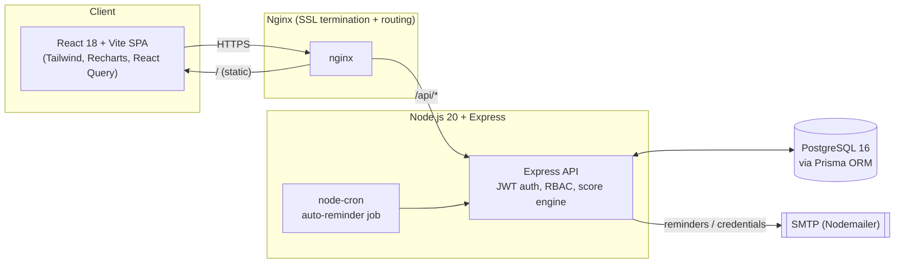

# Profiling 2027 — Feedback Portal

A single portal replacing the manual Google Form → Google Sheets → Looker
Studio pipeline used to run the weekly self/peer feedback cycle for the QCI
Padma Awards Profiling Project. Built per `Profiling_2027_Feedback_Portal_Technical_Spec_v3.docx`.

It automates: self/peer evaluation collection, peer-mapping generation from
the team roster, weekly score computation (including the three peer
sub-cases and the SAPA factor), compliance tracking with reminder emails,
role-scoped dashboards/analytics, and Excel export — all backed by a real
relational database instead of a spreadsheet.

## Architecture



| Layer | Technology | Purpose |
|---|---|---|
| Frontend (SPA) | React 18 + Vite + Tailwind CSS | Role-aware UI, forms, dashboards, charts |
| API Layer | Node.js 20 + Express | REST API, business logic, score computation |
| Database | PostgreSQL 16 + Prisma ORM | Persistent storage, relational integrity |
| Auth | JWT + bcrypt | Token-based authentication, role-based access |
| Notifications | Nodemailer + node-cron | Automated email reminders for non-responders |
| Charts | Recharts + hand-rolled SVG/CSS (heatmap, quadrant, SAPA gauge) | Trend lines, radar, heatmaps, quadrant plot |
| Reverse Proxy | Nginx | SSL termination, static file serving, routing |
| Export | ExcelJS | `.xlsx` weekly + combined score sheets |
| Deployment | Docker + Docker Compose | Reproducible builds |

## Repository layout

```
backend/
  prisma/schema.prisma      # projects, users, peer_mappings, weeks, evaluations, computed_scores
  prisma/seed.js            # demo roster (Padma 2026 actuals) + 6 weeks of synthetic evaluations
  src/server.js             # Express app entrypoint
  src/routes/*.routes.js     # one file per resource
  src/controllers/          # request handlers
  src/services/             # score engine, peer-mapping generator, compliance, analytics, export, mailer
  src/middleware/           # JWT auth, role guard, error handler
  src/jobs/reminderCron.js  # day-2-of-window auto-reminder sweep
  Dockerfile, docker-entrypoint.sh (runs `prisma migrate deploy` on boot)

frontend/
  src/pages/                # Login, Dashboard, Evaluate, Scores, Team, Compliance, Analytics, Admin
  src/components/           # Sidebar, Layout, ProtectedRoute, chart components
  src/api/                  # axios client + typed endpoint wrappers
  src/context/AuthContext.jsx
  Dockerfile, nginx.frontend.conf

deploy/nginx/nginx.conf     # root reverse proxy (SSL termination + routing)
docker-compose.yml          # postgres + backend + frontend + nginx
```

## Local development

Prerequisites: Node 20+, PostgreSQL 16 running locally (or point `DATABASE_URL` at any Postgres instance).

```bash
# 1. Database
createdb profiling2027   # or: psql -c "CREATE DATABASE profiling2027;"

# 2. Backend
cd backend
cp .env.example .env      # edit DATABASE_URL / JWT_SECRET as needed
npm install
npm run prisma:migrate    # applies schema
npm run seed               # loads demo roster + 6 weeks of seeded evaluations
npm run dev                 # http://localhost:4000

# 3. Frontend (separate terminal)
cd frontend
npm install
npm run dev                 # http://localhost:5173 (proxies /api to :4000)
```

Demo login (any seeded user, e.g. the admin): **harshit.qci@gmail.com** /
**Profiling2027!** — see `backend/prisma/seed.js` for the full roster. The
seed reuses the same 10 people (with real names/roles/fields) from the
provided interactive prototype; the actual 61-person 2027 roster gets
loaded for real via **Admin Panel → Import Roster (CSV)**, which also
auto-regenerates `peer_mappings`.

## Environment variables

See `backend/.env.example` and `frontend/.env.example`. Notably:
- `JWT_SECRET` — required, no insecure default (the server refuses to boot without it).
- `SMTP_USER`/`SMTP_PASS` — if unset, the mailer falls back to a console-logging
  no-op transport so reminders/roster emails still "send" in dev without real SMTP.
- `REMINDER_CRON` — node-cron expression for the daily auto-reminder sweep (§4.4.04).

## Database schema

Six tables, mirroring the technical spec exactly: `projects` (one row per
award cycle, e.g. Padma 2027/2028 — this is what makes the platform
reusable year-on-year), `users`, `peer_mappings` (the digital "Ideal
Mapping" tab, auto-generated from role + field rules), `weeks`,
`evaluations` (one row per self/peer submission — replaces "Form
Responses 1"), and `computed_scores` (materialised weekly scores,
recomputed in real time on every submission — replaces the "Scores for
Week XX" tabs).

## Score computation engine (`backend/src/services/scoreEngine.js`)

- **Self**: direct scores if submitted, else all-zero.
- **Peer** — three sub-cases, all handled by one averaging rule: average
  across however many peer evaluations were received (0 peers → 0).
- **SAPA factor** = Total(Self) / Total(Peer), computed only when both are
  non-zero.
- Recomputed synchronously on every `POST /api/evaluations`, and in bulk
  when a week is closed (so non-responders still get a zeroed row).

## Access control

Enforced in `backend/src/services/access.js` per the spec's access matrix:
Profilers/Anchors see only their own scores (+ field team for anchors);
Project Lead sees all Profilers + Group Anchors but not CASU roles; CASU
Lead and Admin see everything; only Admin manages the roster and
opens/closes weeks. The same scoping drives which nav items and analytics
views the frontend renders.

## API summary

All `/api/*` routes except `/api/auth/*` require `Authorization: Bearer <JWT>`.

| Method | Endpoint | Notes |
|---|---|---|
| POST | `/api/auth/login`, `/api/auth/reset-password`, `/api/auth/reset-password/confirm` | |
| GET | `/api/users/me` | |
| GET | `/api/weeks`, `/api/weeks/:id/status` | |
| POST | `/api/evaluations` | upserts; recomputes the evaluatee's score |
| GET | `/api/evaluations/pending` | for the current open week |
| GET | `/api/scores/:userId/:weekId`, `/api/scores/:userId/trend`, `/api/scores/field/:field/:weekId` | scoped per access matrix |
| GET/POST | `/api/compliance/:weekId`, `/api/compliance/:weekId/remind` | |
| GET | `/api/analytics/heatmap/:weekId`, `/api/analytics/sapa/:weekId`, `/api/analytics/quadrant/:weekId` | |
| GET | `/api/export/scores/:weekId`, `/api/export/scores/combined` | `.xlsx` download, admin only |
| POST | `/api/admin/weeks/:id/open`, `/api/admin/weeks/:id/close`, `/api/admin/roster/import` | admin only |

## Deployment

```bash
cp .env.example .env   # set POSTGRES_PASSWORD, JWT_SECRET, CORS_ORIGIN, SMTP_*
docker compose build
docker compose up -d
```

This brings up Postgres, the API (migrations auto-applied via
`docker-entrypoint.sh` → `prisma migrate deploy`, running under PM2 inside
the container), the built frontend served by its own Nginx, and a root
Nginx reverse proxy on ports 80/443. Point your domain's DNS at the VM,
edit `server_name` in `deploy/nginx/nginx.conf`, then run
`certbot --nginx -d feedback.qcin.org` on the host to add the HTTPS server
block and auto-renewal. Seed the first cycle with
`docker compose exec backend npm run seed`, or import the real roster from
**Admin Panel** once logged in.

`docker compose config` and the individual Dockerfiles were validated in
this environment; a full `docker compose build` could not be exercised
end-to-end here because the sandbox's network policy blocks the Docker Hub
CDN (`production.cloudfront.docker.com`) used to fetch base image layers —
this is a sandbox restriction, not a project issue, and a normal cloud VM
with unrestricted egress will pull `node:20-alpine` / `nginx:1.27-alpine`
without trouble. The backend and frontend were otherwise fully verified
by running them directly (Node + Vite dev server) against a real local
Postgres instance, including a live browser walkthrough of every page for
every role.

## Known limitations / next steps

- **Sentiment analysis** in the quadrant plot (`backend/src/services/analytics.js`)
  is a lightweight heuristic (Problem-Solving satisfied-ratio + strength/weakness
  tag balance), not a trained NLP model — swap in a real sentiment model if the
  Actionable Insights document's thematic analysis needs to go further.
- No automated test suite yet (verified via manual + scripted end-to-end
  smoke testing against a live Postgres instance and a live browser for this
  build). Add Vitest/Jest + Playwright if ongoing CI coverage is wanted.
- CI/CD (GitHub Actions auto-deploy) is listed in the spec's stack table but
  not wired up — natural next step once a target VM/registry exists.
